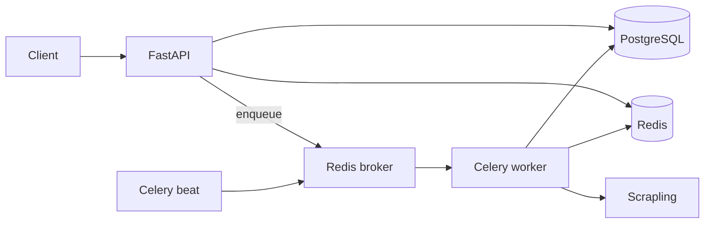

> Claude Code: modular rules in `.claude/rules/` — [Memory & rules](https://code.claude.com/docs/en/memory). Cursor equivalent: `.cursor/rules/architecture.mdc`.

# Architecture - Pilgrim Service

Pilgrim is a **large-scale crawler service**: **FastAPI** for control-plane APIs, **Celery + Redis** for execution, **PostgreSQL** for durable state, **Scrapling** (and optional Playwright) for fetching/parsing.

## 1. Logical components

| Component | Responsibility |
|-----------|----------------|
| **API** | Auth, CRUD for configs/schedules/proxies, AI endpoints, enqueue jobs, read status |
| **Worker** | Execute scrape tasks, run spiders, proxy fetch/validate, write results |
| **Beat** | Periodic schedules (cron / interval), proxy expiry → enqueue tasks |
| **Redis** | Broker, result backend cache, optional rate-limit / locks |
| **PostgreSQL** | Configs, jobs, schedules, proxy sources, valid proxies, results, audit |

## 2. Recommended directory layout

```
app/
├── api/
│   └── v1/
│       └── endpoints/
├── core/
│   ├── config.py
│   ├── logging.py
│   └── exceptions.py
├── db/
│   ├── database.py
│   └── migrations/
├── models/
├── schemas/
├── services/
│   ├── crawl_job_service.py
│   ├── crawl_config_service.py
│   ├── schedule_service.py
│   ├── proxy_source_service.py
│   ├── valid_proxy_service.py
│   ├── proxy_parser.py
│   └── ai_service.py
├── crawlers/
│   ├── factory.py          # Scrapling profile → fetcher/session
│   ├── extraction.py       # Config-driven extraction
│   ├── spiders/            # Scrapling Spider classes
│   └── playwright/         # Rare direct Playwright helpers
├── workers/
│   ├── celery_app.py
│   └── tasks/
│       ├── scrape.py
│       ├── proxy.py
│       └── maintenance.py
├── integrations/
│   ├── redis.py
│   ├── llm_base.py
│   ├── llm_provider.py
│   └── ollama.py
└── main.py
```

- **FastAPI** must stay thin: validate input, call services, return DTOs.
- **Heavy I/O** only in Celery workers (and optionally a dedicated `io` worker pool).

## 3. Data flow



1. Client creates/updates **crawl config** and **schedule** → persisted in PostgreSQL.
2. API or Beat enqueues **`run_crawl_job`** (or per-URL tasks) → Redis.
3. Worker loads config, runs Scrapling (or spider), normalizes output, writes **job run** + **artifacts** (as designed).
4. Client polls **job status** via API (DB as source of truth; Redis for optional progress).

## 4. Queue and worker topology

- **`crawl_high`**: user-triggered, SLA-sensitive.
- **`crawl_default`**: routine / bulk.
- **`crawl_low`**: backfill, large spiders.
- Optional **`maintenance`**: cleanup, reindex, health probes.

Route tasks with Celery `queue=` and worker `-Q` flags (see `docker-infrastructure` rule).

## 5. Idempotency and deduplication

- **Job id**: UUID; client may pass `Idempotency-Key` header mapped to dedupe hash.
- **Per-target locks**: short TTL in Redis (`SET key NX EX`) to prevent duplicate concurrent scrapes of the same URL + config revision.
- **Results**: upsert by business key (e.g. `store_id` + `product_url` + `config_version`).

## 6. Error handling strategy

- **Transient errors** (timeout, 5xx, rate limit): retry with backoff in Celery; cap max retries.
- **Permanent errors** (404, parse contract broken): fail job with structured error code; alert if parse failure rate spikes.
- **Config errors**: validate at API; worker should not “guess” missing selectors.

## 7. Observability

- **Logging**: structlog JSON; correlation id = `crawl_job_id` + `celery_task_id`.
- **Metrics**: OpenTelemetry or Prometheus-friendly counters (tasks succeeded/failed, latency, block rate).
- **Tracing**: optional OTel spans around fetch + parse (avoid logging full HTML).

## 8. Security boundaries

- **Secrets** only via env / Docker secrets; never commit.
- **Admin** endpoints protected (API keys or JWT with roles).
- Workers have **no inbound** ports in production; only outbound to targets, Redis, Postgres.

## 9. Scaling rules of thumb

- Scale **workers** horizontally for throughput.
- Scale **API** for read-heavy dashboards; keep writes bounded.
- **Postgres**: connection pool per process; use PgBouncer if many workers.
- **Redis**: separate logical DB or key prefix for broker vs cache vs locks.

This architecture keeps control plane and data plane separated and fits Docker Compose today and Kubernetes later without redesign.
